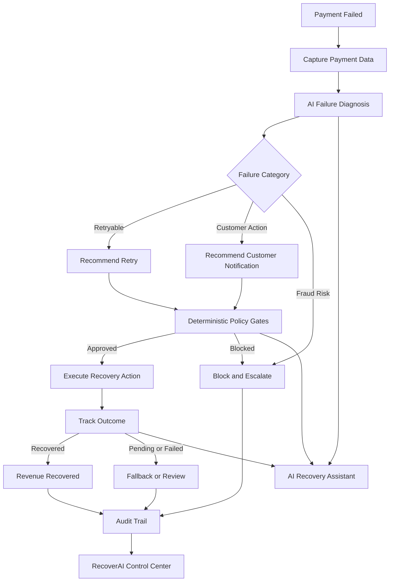

# RecoverAI

RecoverAI is a deterministic revenue-recovery control center for failed payments. It diagnoses each failure, selects the lowest-cost eligible intervention, applies execution-time safety rules, and records every decision and outcome in Supabase.

Built for the Razorpay Buildathon 2026, Track 3.

## 🔄 RecoverAI Recovery Workflow

**Detect → Diagnose → Decide → Validate → Intervene → Verify → Audit**



## 📁 Project Structure

```text
AI-Revenue-Recovery/
│
├── recovery/                         # Core revenue-recovery logic
│   ├── decision_engine.py            # Determines the recommended recovery action
│   ├── stopping_rules.py             # Safety limits and escalation rules
│   ├── auto_retry_executor.py        # Controlled payment-retry execution
│   └── outcome_tracker.py            # Tracks intervention and recovery outcomes
│
├── channels/                         # Recovery communication channels
│   ├── whatsapp_notifier.py          # WhatsApp notification workflow
│   └── voice_caller.py               # Voice escalation workflow
│
├── tests/                            # Automated tests
│   └── test_agent.py                 # Recovery engine and safety-rule tests
│
├── data/                             # Synthetic demo dataset
│   ├── customers.csv                 # Customer records
│   └── transactions.csv              # Failed-payment records
│
├── design-system/                    # UI design system and visual guidelines
│   └── revenue-recovery-agent/
│       └── MASTER.md
│
├── dashboard.py                      # Streamlit application and dashboard
├── run_pipeline.py                   # Runs the recovery pipeline
├── db.py                             # Supabase database access layer
├── config.py                         # Environment and application configuration
│
├── generate_synthetic_data.py        # Generates demo customers and transactions
├── setup_database.py                 # Creates database tables and views
├── reset_demo.py                     # Resets the demo environment
│
├── schema.sql                        # Supabase database schema
│
├── .env.example                      # Example environment configuration
├── requirements.txt                  # Python dependencies
├── README.md                         # Project documentation
├── DESIGN.md                         # UI/UX notes
└── LICENSE                           # MIT License
```
## 🛠️ Tech Stack

| Category | Technology |
|---|---|
| **Frontend** | Streamlit |
| **Backend** | Python |
| **Database** | Supabase PostgreSQL |
| **Recovery Engine** | Python Decision Engine |
| **Safety & Guardrails** | Deterministic Policy & Stopping Rules |
| **Communication** | Twilio WhatsApp Sandbox |
| **Testing** | Pytest |
| **Data** | Synthetic Payment Dataset |


## Requirements

- Python 3.11 or newer
- A Supabase project for the full pipeline and dashboard
- Supabase Project URL
- Supabase Secret key, formerly called the service-role key

Twilio, Bolna, Vapi, and Razorpay credentials are optional and are not needed while dry-run mode is enabled.

## Windows PowerShell Setup

Run commands from the repository root.

### 1. Create and activate the virtual environment

```powershell
py -3.13 -m venv .venv
.venv\Scripts\Activate.ps1
```

If PowerShell blocks activation for the current session:

```powershell
Set-ExecutionPolicy -Scope Process -ExecutionPolicy RemoteSigned
.venv\Scripts\Activate.ps1
```

### 2. Install dependencies

```powershell
.venv\Scripts\python.exe -m pip install -r requirements.txt
```

### 3. Configure environment variables

Copy `.env.example` to `.env` and fill in only the Supabase values:

```powershell
Copy-Item .env.example .env
```

Set these values in `.env`:

```env
SUPABASE_URL=https://your-project.supabase.co
SUPABASE_KEY=your-supabase-secret-key
DRY_RUN=true
```

Never commit `.env` or paste secret keys into the repository.

### 4. Create the database tables

Open the Supabase SQL Editor, paste the complete contents of `schema.sql`, and run it. Keep Row Level Security enabled. The application uses the Supabase Secret key for its server-side demo operations.

### 5. Load the synthetic dataset

The current CSVs contain 30 customers and 120 transactions. To replace existing demo data with the CSVs:

```powershell
.venv\Scripts\python.exe setup_database.py --force
```

### 6. Run the recovery pipeline

```powershell
.venv\Scripts\python.exe run_pipeline.py
```

### 7. Start the dashboard

```powershell
.venv\Scripts\python.exe -m streamlit run dashboard.py
```

Open [http://localhost:8501](http://localhost:8501).

## 🖥️ Product Overview

### 1. Detect Revenue Leakage
Identify failed payments and quantify revenue currently at risk.

### 2. Diagnose the Failure
Classify the failure and determine whether it is retryable, requires customer action, or should be blocked/escalated.

### 3. Decide the Recovery Strategy
Select the most appropriate intervention based on failure type, customer context, previous attempts, and recovery rules.

### 4. Validate Before Acting
Apply deterministic policy gates such as retry limits, contact limits, fraud-risk checks, and communication windows.

### 5. Execute & Verify
Run the approved recovery action and track whether the transaction recovered, failed, or requires further review.

### 6. Audit Everything
Record the decision, policy checks, intervention, and outcome so every recovery attempt is explainable and traceable.

## Common Commands

```powershell

# Run one complete safe recovery round
.venv\Scripts\python.exe run_pipeline.py

# Run only the decision engine against local CSV files
$env:SUPABASE_URL=""; $env:SUPABASE_KEY=""; .venv\Scripts\python.exe recovery\decision_engine.py

# Run the WhatsApp simulator directly
.venv\Scripts\python.exe -m channels.whatsapp_notifier

# Verify database connection and table counts
.venv\Scripts\python.exe setup_database.py --check

# Run the built-in tests without pytest
$env:PYTHONPATH=(Get-Location).Path; .venv\Scripts\python.exe tests\test_agent.py
```

## Testing

The project includes 56 credential-free tests. They verify rule precedence, stopping rules, call windows, contact accounting, dry-run channels, voice normalization, and dashboard theme constraints.

```powershell
$env:PYTHONPATH=(Get-Location).Path
.venv\Scripts\python.exe tests\test_agent.py
```

`pytest` is optional; it is not required by the project.

## 🛡️ Safety & Guardrails

RecoverAI separates AI decisioning from execution. Every recovery action must pass deterministic safety checks before it can be executed.

- Retryable failures are eligible for controlled retry within the configured attempt limit.
- Fraud or risk-flagged payments are blocked from automated recovery.
- Customer contacts are capped to prevent repeated outreach.
- Voice or customer-contact actions are restricted to allowed communication hours.
- Failed or unavailable recovery paths fall back to manual review instead of continuing blindly.
- `DRY_RUN=true` is enabled by default, so recovery actions are simulated safely during the demo.
- Every decision, policy check, intervention, and outcome is recorded in the audit trail.

  ## 🌙 Failure Recovery / 2 AM Scenario
  - If a recovery action fails or a provider becomes unavailable, RecoverAI stops unsafe execution, applies fallback/stopping rules, and records the event for manual review.
  - 
  ### Example

**Payment failure → Recovery decision → Provider unavailable → Action stopped/fallback triggered → Event logged → Manual review**

The goal is to ensure that a failure in the recovery system does not create a second failure for the customer or the business.

 ## What It Does

- Analyzes failed payments and their failure reasons
- Selects `auto_retry`, `whatsapp`, `voice_call`, or manual review
- Blocks fraud-risk contact and enforces a three-contact cap
- Defers voice actions outside the 9:00-21:00 calling window
- Simulates retry, WhatsApp, and voice actions safely by default
- Maintains an append-only audit trail
- Provides a Streamlit control center with queue, decisions, customers, health, and Copilot views

The bundled dataset contains 30 synthetic customers and 120 synthetic failed transactions. All contact data is synthetic or masked.


